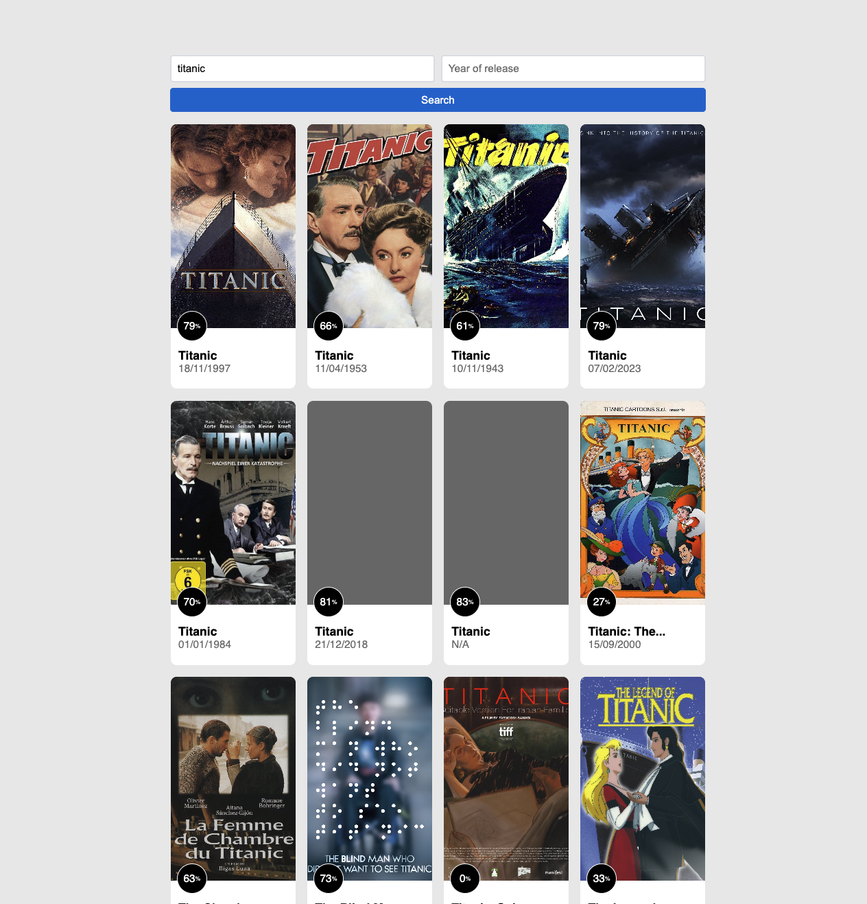

# Technical test fullstack

## Description

This project is a technical test for a fullstack developer position. The project is a web app that allow user to search and display films from TMDB.

## Run the project

To run the project, you need to have a TMDB API key. You can get one by creating an account on [TMDB](https://www.themoviedb.org/). Once you have your API key go to packages/client and create a `.env` file at this place (or duplicate .env.dist) and add the following line:

```
VITE_TMDB_API_KEY="your_api_key"
```

then `npm install` and `npm run dev`, client will be available at `http://localhost:5173`.

## Features

Asked: 
- Search films by title and year (optional).
- Display films details (title, note, release date).
- Form with loader.
- Pagination.
- no data and error message.

Bonus:
- Movie card designed like original TMDB website.


